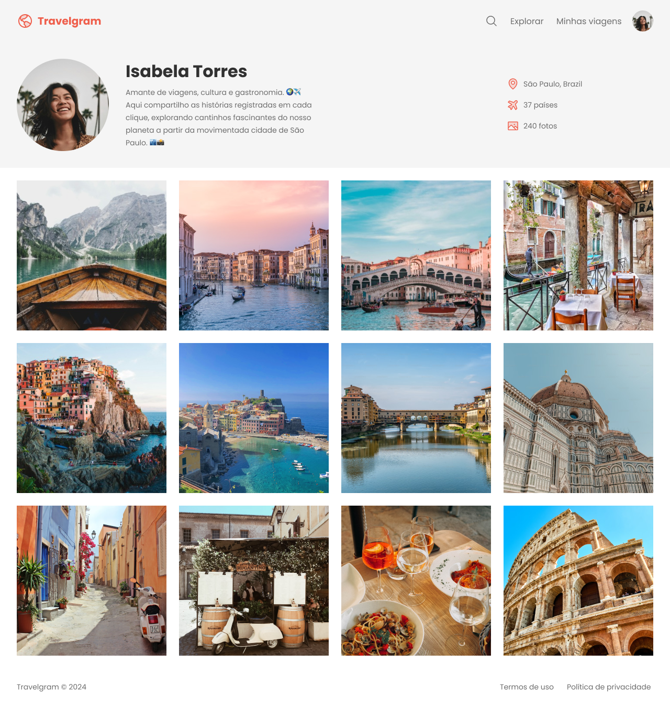

# Travelgram

Travelgram é uma plataforma para compartilhar experiências e fotos de viagem. Conecte-se com viajantes de todo o mundo e descubra novos destinos!

## Captura de Tela

## Funcionalidades

- **Compartilhamento de Fotos**: Publique suas fotos de viagem e inspire outros viajantes.
- **Histórias de Viagem**: Escreva e compartilhe suas histórias de viagem, dicas e recomendações.
- **Comunidade**: Interaja com outros usuários, comente e curta as postagens.
- **Descubra Destinos**: Explore destinos populares e menos conhecidos através das postagens da comunidade.

## Como Começar

1. **Crie uma Conta**: Registre-se na plataforma para começar a compartilhar suas experiências.
2. **Publique Suas Fotos**: Faça upload de suas fotos e escreva sobre suas aventuras.
3. **Interaja com Outros**: Comente e curta as postagens de outros usuários para construir uma comunidade.

## Contribuições

Contribuições são bem-vindas! Se você deseja ajudar a melhorar o Travelgram, siga estas etapas:

1. Fork o repositório.
2. Crie uma nova branch (`git checkout -b feature/nome-da-sua-feature`).
3. Faça suas alterações e commit (`git commit -m 'Adicionando uma nova feature'`).
4. Envie para o repositório remoto (`git push origin feature/nome-da-sua-feature`).
5. Abra um Pull Request.

## Licença

Este projeto está licenciado sob a Licença MIT - veja o arquivo [LICENSE](LICENSE) para mais detalhes.

## Contato

Para dúvidas ou sugestões, entre em contato pelo e-mail: contato@travelgram.com.

---

Aproveite sua jornada com o Travelgram!
